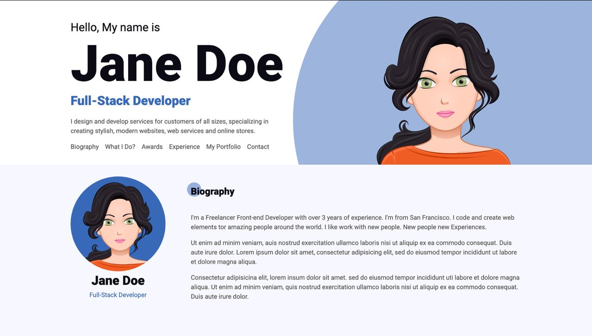

# First Landing Page

My first landing page built after completing a web development course.  
Created with HTML5 & CSS3 to practice basic layout, typography, and responsive design.

## 📸 Preview

## 🚀 Live Demo
🔗 [View on GitHub Pages](https://chipqp.github.io/first-landing-page/)

## 🛠 Technologies Used
- **HTML5** – semantic markup
- **CSS3** – flexbox, grid, and basic animations
- **Responsive design** – works on desktop and mobile